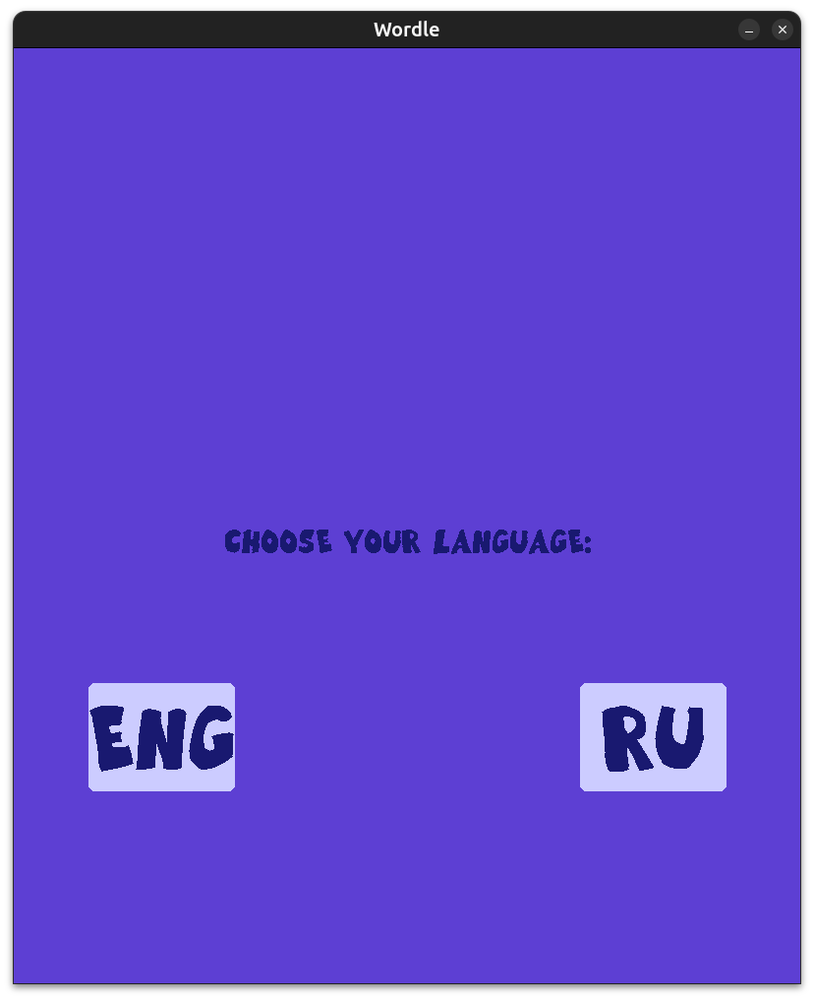
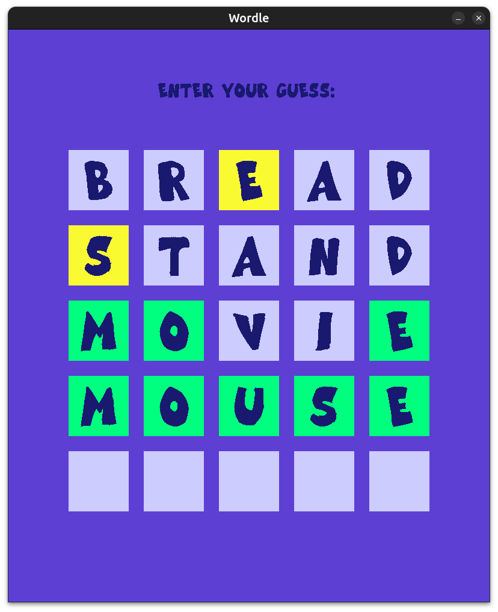
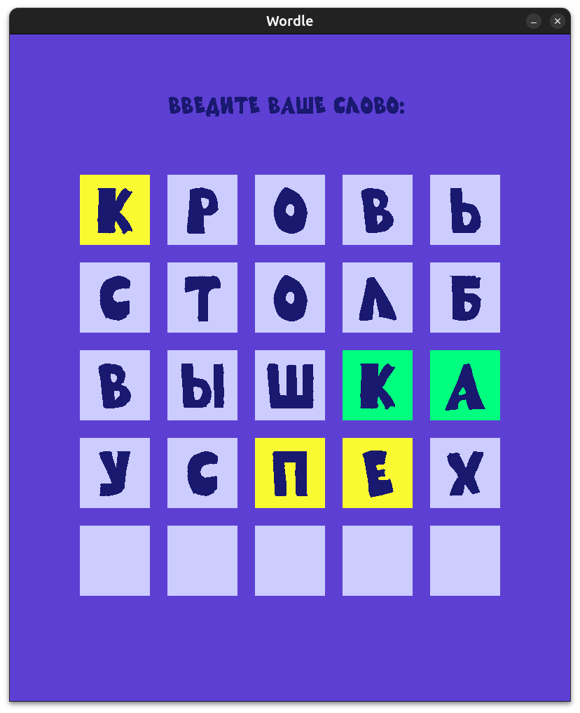

# Wordle

My clone of the game "Wordle". Implemented with Pygame, Python. 

Two languages are provided (English, Russian).

## How to run

With the [uv](https://docs.astral.sh/uv/): `uv sync`, then `uv run game.py`

## Screenshots

<table>
<tr>
<td>

</td><td>

</td><td>

</td>
</tr>
</table>